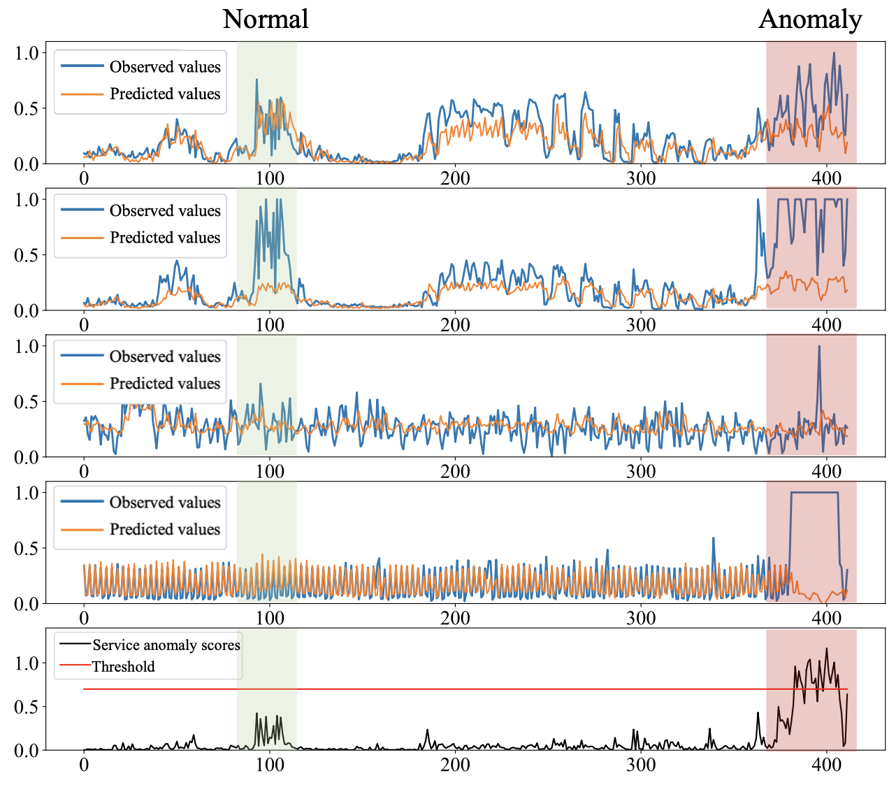

## Replication Package for Paper FSE22-105 

Our paper has been submitted to FSE'2022, whose title is:

> Understanding and Detecting Cloud Service Anomalies from Multivariate Monitoring Metrics

We aim to accurately detect anomalies of complex services monitored by multivariate metrics. The challenge in this task is to capture the dependencies between the multivariate metrics to avoid too many false positives. The following figure is a motivating example, the normal area (marked green) indicates that the service is healthy, but the first two metrics seem abnormal. The anomaly part (marked red) show that the service is anomalous because collective patterns show in all metrics.

Our algorithm **LOCATE**, can capture the dependencies, and present a higher anomaly score for the multivariate metrics in the true anomaly area.

### Repository organization

./benchmark: Entry of the proposed method LOCATE

./common: Helper functions and classes

./datasets/anomaly: Dataset used in our paper

./networks: detailed implementation of LOCATE and baseline models

### Industrial Dataset

All dataset used to conduct our empirical study and evaluation is archived in ./datasets/anomaly. Two groups of datasets (i.e., Dataset_A and Dataset_B) are used. For example, in the folder  ./datasets/anomaly/Dataset_A, multivariate monitoring metrics for six services collected from our industrial environment are provided.

The anomalous time ranges are manually labeled, and we believe the datasets can benefit related research in this area. 

### Dependency

> python >= 3.6
>
> numpy==1.19.5
>
> scikit-learn==0.24.2
>
> pytorch==1.4.0  

Detailed configuration for pytorch can be found here [Start Locally | PyTorch](https://pytorch.org/get-started/locally/).

### Usage

`python locate_benchmakr.py --dataset Dataset_A --lr 0.01 --window_size 32 --stride 5 --nb_epoch 100 --batch_size 1024 --gpu 0`

Note that if you want to use cpu to train the model, please specify `--gpu -1`

### Easy customization for your own dataset

We define a easy-to-use interface for LOCATE to be adopoted in different scenarios, one can follow the steps to customize LOCATE for your dataset.

- Format your dataset to three pickle files containing numpy arrays (see ./datasets/anomaly/Dataset_A).
- Add your dataset to `common/config.py and common/dataloader.py (line 9-33)`.
- Run the execution command by specifying your dataset with the parameter `--dataset`

### Acknowledge

The implementations of baseline models we use are from the following repositorires:

LODA, IF, OCSVM, PCA, AE: https://github.com/yzhao062/pyod

LSTM-VAE: https://github.com/TimyadNyda/Variational-Lstm-Autoencoder

DAGMM: https://github.com/danieltan07/dagmm

OmniAnomaly: https://github.com/NetManAIOps/OmniAnomaly

Many thanks to the excellent work.